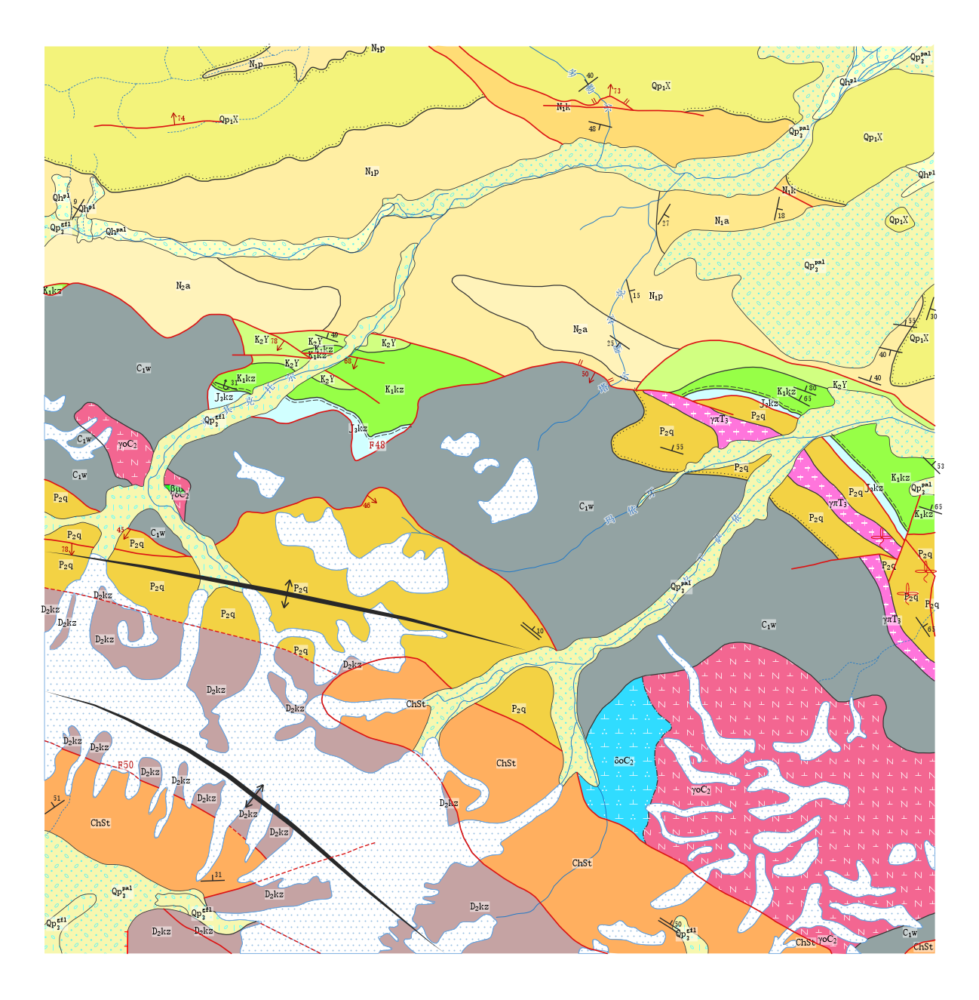

# geosciml4china

[](https://pypi.org/project/geosciml4china/)
[](https://pypi.org/project/geosciml4china/)
[](LICENSE)
[](https://github.com/leecugb/geosciml4china/actions)

**Self-supporting geological-semantics calibration and GeoSciML 4.1 interoperability for China's 1:250,000 regional geological map sheets.**

`geosciml4china` turns a legacy MapGIS project folder into trustworthy, confidence-graded geological semantics: **MapGIS → L0 GeoJSON → self-supporting semantic calibration → semantic L1 GeoJSON → GeoSciML 4.1 → semantics-driven rendering**, with every stage machine-verifiable (scope ruling 2026-09-29: input = the MapGIS project document folder).



*Full-sheet render of the bundled [testdata end-to-end case](data/testdata_mapgis/README.md): calibrated strata polygons in DZ/T 0179-2025 colors, geological boundaries, fault lines with decorations and fault attitude measurement points (a–b–a composite semantics). The canvas is scale-anchored (≈31.75 m per pixel at 1:250,000), so style dimensions — line widths, pattern tiles, symbols — are identical across sheets regardless of sheet extent.*

## The problem

China's 1:250,000 geological map archives (729 map sheets covering the land area; Zuo et al., 2018) were digitized under a unified national code system (DZ/T 0179 symbology, DD2006-06 database specification), yet the *data* systematically deviates from the *specification*, and the dictionary needed to interpret the deviations is not publicly available. We observe four independent dimensions of drift:

- **code values** — sheets introduce undocumented codes (e.g. Yingjisha J43C002003: four new fault codes on 83/289 segments, 29% of that sheet's faults);
- **sub-number double meanings** — sub-type 1894 means *fault dip direction* on Kurgan but *fold auxiliary* on Yingjisha;
- **reversed angle conventions** — 1894 uses a 0° convention, 1851 a 180° convention;
- **category renaming** — the same point class appears under different names across sheets.

The specification layer is uniform, the data layer is divergent, and the dictionary is missing. Schema matching assumes two formal specifications; map QA checks geometry only; conversion implementations assume the codes are already meaningful. International practice treats legacy-map → standard-vocabulary mapping as manual labor (USGS GeMS translation guidance, NGMDB OF 2010-1335, OneGeology portrayal cookbook). To our knowledge, **automatic semantic recovery of legacy map codes without the dictionary** is not addressed by any of these lines of work — including recent knowledge-graph efforts over Chinese vector maps, which all start from known field meanings (Qiu et al., 2024; Duan et al., 2024). Every sheet therefore carries a calibration debt that cannot be discharged by lookup, only by evidence from the map itself.

## The approach: self-supporting semantic calibration

Calibration proceeds from the map's own evidence — geometric invariants, spatial topology, and cross-channel corroboration — under four governing principles:

1. **Generalization** — rule code has zero sheet-specific branches; sheet-specific values (character distances, exemptions, code-semantics registries) live in sheet profiles and registries. New sheets onboard with a single zero-injection census command (`g4c probe`).
2. **MLE voting** — code semantics are assigned by a maximum-likelihood vote (code prior 3 / name 2 / signature 2 / kinematics 2 / dip 1 / auxiliary points 2 / cover 2; ties go to the prior; <2 votes fall back to the generic class).
3. **Pipeline integrity** — fallback mechanisms keep the chain running (unresolvable codes → general fault + detailed archive).
4. **Contradiction preservation** — evidence conflicts never auto-rewrite codes; they are registered pending human adjudication, and adjudications take effect through an overrides layer while the original vectors remain untouched.

The calibration is organized in **three levels**: L1 segment-level self-supporting calibration (per-feature MLE over geometric evidence and priors) → L2 code-level global MLE mapping (full-sheet code→semantics tables, editable through a modify-reconvert loop) → L3 table-driven conversion (GeoSciML built strictly from the mapping tables). Structural×kinematic compatibility is declared as an **abstract consistency constraint** (reverse↔compressive, normal↔extensional, strike-slip↔sense; generic/uncertain elements are neutral; composite faults are consistent when any component matches) — a semantic-level relation that is sheet-invariant, with code-value differences carried by per-sheet registries. Every verdict carries a confidence grade from the unified S×I×F framework (source tier × evidence independence × fit; bands: consistent / suspect / conflict / unassessed), which gates rendering and GeoSciML consumption. Closed-loop adjudication also repairs encoding defects of the data itself — discovered, attributed, ruled, applied via the overrides layer, and re-checked.

## Evidence

**Generalization — four zero-injection projects** (D:/11, D:/22, D:/33, D:/testdata; onboarded by census only, no external calibration), all verified 2026-10-05:

| project | units | polygon MFs | contacts | fault segments | GeoSciML members | verify | render mirror |
|---|---|---|---|---|---|---|---|
| y1 (D:/11) | 57 | 713 | 1318 | 310 | 4738 | 29/29 | 7/7 |
| y2 (D:/22) | 95 | 808 | 1199 | 289 | 4357 | 29/29 | 7/7 |
| y3 (D:/33) | 58 | 543 | 734 | 341 | 3744 | 29/29 | 7/7 |
| td (D:/testdata) | 20 | 107 | 143 | 52 | 575 | 29/29 | 7/7 |

Invariants across all four: zero pending codes, zero nil faultType, zero XSD errors, cartographic-contradiction overlay hits equal the verify contradiction-banner counts (19/14/35/0), strike-slip hook side-violations zero, attitude-pair orthogonality deviations zero.

**Error correction as a product** — on D:/11, 59 of 2222 boundary segments (2.7%) are registered as code–prior conflicts (e.g. the Quaternary-boundary code used on bedrock–bedrock contacts, 42 segments) and held for human adjudication; blank-code polygons and zero-length boundaries are excluded from the GeoSciML output with the source untouched; on aoyiyayilake, 48 intrusive polygons with Cyrillic/math-symbol variants of Greek prefixes (г/∑ for γ/σ) are resolved through the attribute-first lithology channel.

**Full-sheet calibration on Kurgan (J43C001002)**: 2222 boundary segments, 310 fault segments, 299 fault aux points, 305 attitudes, 78=78 annotation pairing — all verified at full scale.

**External anchor**: the calibrated layer set is 100% consistent with the official 《成矿地质背景研究数据模型》 data-model system (Zuo et al., 2018, *Geology in China* 45(S1):1–26, doi:10.12029/gc2018Z101).

**Knowledge generation, not only correction**: on Yingjisha, the discriminator generated a testable semantic hypothesis for an unregistered code (code 03 ↔ GZELD=102, a perfect 38:38 one-to-one correspondence, consistent with a normal fault).

**GeoSciML compliance**: output validates against the official `geoSciMLExtension.xsd` plus 29 business assertions on every calibrated sheet; per-sheet element-level source–target reconciliation; Lite views emitted.

**Rendering fidelity**: the semantics-driven render is reconciled against the L1 mirror (C1–C7 checks: counts, geometry multisets at 1e-12, color re-derivation, attitude angles, semantic distributions, measurement-point foot-of-perpendicular).

**Regression suite**: 53 tests — 46 pure-logic unit tests (kin-consistency truth tables, fault-name priority, GZELD priors, era-suffix stripping, intrusive name-first channel, color-library loading; run in CI against the minimal PyPI stack) plus a 7-test end-to-end audit over the bundled raw MapGIS test data.

## Pipeline

The pipeline is organized as **three orthogonal interfaces** (2026-10-06); each is independently runnable and its input/output contract is one artefact:

1. **`g4c prepare`** — file-completeness check (11-file contract) → MapGIS→L0 conversion (incremental skip when L0 is newer) → nine-domain self-supporting calibration (two-phase materialization) → gap report → **emits the codebook** (`codebook_<key>.json`, the reconstructed dictionary; user-editable, edits preserved across regeneration).
2. **`g4c convert`** — GeoSciML conversion **built on the codebook**: stylegen (semantics + DZ/T 0179-2025 colour library) → build (GML + Lite views + pending register) → verify (XSD + 29 assertions; `--accept-portrait` locks the first-run portrait).
3. **`g4c render`** — semantics-driven rendering with C1–C7 L1-mirror reconciliation (1–99 percentile crop by default, scale-anchored canvas at true 1:250,000 map scale, overlays).

`g4c pipeline` composes the three in order (backward-compatible flags). Typical loops: edit the codebook → `g4c convert`; change styles → `g4c render`.

- **Calibration** (`geosciml4china.calibrate`): nine domains — boundaries (GZBD, adaptive 40/100/250 m flanking-unit probes), fault entity grouping, fault aux-point chains (a–b/a–b–a patterns, strike-slip hook pairs), fault-contact activity audit, fault kinematics (GZEEB, with GZELD global kinematic priors 101 compressive / 102 extensional / 103 dextral / 104 sinistral), attitudes (strike⊥dip hard invariant), fossils/mud volcanoes, folds, inferred faults. Prior library driven (Xinjiang regional contact-relationship priors = dual-source highest-knowledge base, shipped as package data).
- **Conversion** (`geosciml4china.convert`): six feature classes (GeologicUnit / MappedFeature / Contact / ShearDisplacementStructure / Foliation / Fold + fault attitude measurement points); specimens live in the official portrayal view because the GeoSciML 4.1 Sampling package is unpublished.
- **Styles** (`geosciml4china.render.stylegen` / `stylegen_fault`): GeoSciML semantics + DZ/T 0179-2025 color library → rendering styles; sheet adjudications frozen in an overrides layer (generated defaults < adjudication layer).
- **Rendering** (`geosciml4china.render`): thin adapters reusing the pymapgis rendering pipeline; strike-slip end hooks, fault attitude symbols, fold symbols, cartographic-contradiction overlays.
- **Verification** (`g4c verify`): XSD + 29 assertions, with per-sheet EXPECT portraits locking the empirical baselines.

## Dependencies

geosciml4china depends on the **mapgis2shp** project — the same author's open-source package ([GitHub](https://github.com/leecugb/mapgis2shp), [PyPI](https://pypi.org/project/mapgis2shp/)) — which supplies the format layer: reverse-engineered readers for the closed MapGIS 6.x/67 binary vector formats. The dependency is structural, not optional.

> **Stack note**: the PyPI `mapgis2shp` distribution currently ships the minimal reader stack. The full pipeline (L0 conversion, calibration, L1 materialization) additionally needs the `pymapgis.semantics` / `pymapgis.rendering` subpackages, available from the [pymapgis working tree](https://github.com/leecugb/mapgis2shp) (local install, see below). A PyPI installation alone runs `verify`, `render`-side machinery, and the pure-logic test suite; the pipeline stages report the missing stack on first use. Publishing the full stack on PyPI is the next release milestone.

## Installation

```bash
pip install geosciml4china            # from PyPI (minimal-stack mode, see note above)
```

Full-stack local installation (all pipeline stages):

```bash
pip install -e /path/to/mapgis2shp    # pymapgis full stack (semantics + rendering)
pip install geosciml4china            # this package
```

## Quick start (zero-injection onboarding)

```bash
g4c probe --root D:/my-sheet --key mykey --register   # census from the sheet's own data + registration
g4c prepare --sheet mykey                             # interface 1: completeness + calibration → codebook
g4c convert --sheet mykey --accept-portrait           # interface 2: codebook-based GeoSciML conversion
g4c render --sheet mykey                              # interface 3: rendering + mirror checks
```

## Reproducible test cases

**End-to-end over raw MapGIS files** — the repository ships 11 raw MapGIS vectors
([`data/testdata_mapgis/`](data/testdata_mapgis/README.md)) plus a pytest audit
([`tests/test_td_project_audit.py`](tests/test_td_project_audit.py)) that copies
them to a temp project, registers a sheet, runs the full chain, and asserts the
29-assertion pass plus key generalization invariants (blank-code exclusion,
zero-length boundary exclusion, kin-consistency registration, probe census):

```bash
pytest tests/           # 53 tests; the end-to-end module needs the pymapgis full stack
```

**Published L0 of the jws test case (Kurgan sheet J43C001002)** —
[`data/jws_l0_geojson/`](data/jws_l0_geojson/) holds the L0 GeoJSON of the
11-file preflight contract (EPSG:4326) converted from a working copy of the
Kurgan sheet; see [its README](data/jws_l0_geojson/README.md) for the file
catalogue and provenance. Register the sheet (e.g. via `~/.geosciml4china.toml`:

```toml
[sheets.jws]
root = "D:/jws"
code = "J43C001002"
title = "Kurgan sheet copy (J43C001002) full-pipeline test"
expected_units = 57
expected_polygon_dist = { "LDZOFBB001.WP" = 608, "LDZOFBB002.WP" = 10, "LDZOFBB003.WP" = 46, "LDZOFBB004.WP" = 49 }
lite_expect_counts = [713, 1316, 310, 305]
aux_pairs_csv = "fault_aux_number_1894_pairs.csv"
aux_assoc_csv = "fault_aux_jws.csv"
aux_triplets_csv = "_fault_triplets_jws.csv"
calibration_csv = "_gzbd_calibration_report.csv"
```

then run the chain and expect 29/29 assertions and mirror checks C1–C7:

```bash
g4c check --sheet jws      # preflight: 11-file contract
g4c pipeline --sheet jws   # MapGIS → L0 → calibrate → L1 → styles → GML → verify → render
```

## Sheet projects

A sheet project is a directory (sheet root) that by convention holds
`geojson/L1/` (semantic calibration layer), `output/geosciml/` (products),
`data/` or root-level sheet vocabulary mappings and adjudication layers, and
the MapGIS vector files. Four development sheets are registered in-package
(kurgan, yingjisha, aoyiyayilake, bashkurgan).

Third-party sheet registration (pick one):

1. `g4c probe --root <path> --key <key> --register` (zero-injection census + registration);
2. Environment variable: `G4C_ROOT_<KEY>=<sheet root>`;
3. User config `./geosciml4china.toml` or `~/.geosciml4china.toml` (any Sheet field can be overridden);
4. Code: `geosciml4china.sheets.register_sheet(Sheet(...))`.

## CLI

```bash
# three interfaces (2026-10-06)
g4c probe --root D:/sheet --key s1 [--register]    # zero-injection onboarding census
g4c prepare --sheet s1 [--skip-convert] [--skip-calibrate-stages]   # interface 1
g4c convert --sheet s1 [--accept-portrait]         # interface 2 (codebook-based)
g4c render --sheet s1 [--no-overlay] [--full-extent]   # interface 3
g4c pipeline --sheet s1 [--skip-convert] [--skip-calibrate-stages] [--skip-render]
                [--check-only] [--accept-portrait] [--no-pattern] [--dpi 200]
g4c codebook --sheet s1                            # regenerate the codebook JSON

g4c check --sheet s1                               # sheet preflight: 11-file completeness contract
g4c sheets                                         # list registered sheets and resolved roots
g4c data                                           # package-data paths and existence

# domain-level commands (debug / stepwise)
g4c calibrate-gzbd --sheet s1                      # boundary calibration (GZBD)
g4c entities --sheet s1                            # fault entity grouping
g4c auxchain --sheet s1                            # fault aux-point entity-chain discrimination
g4c calibrate-fault-contact-activity --sheet s1    # fault-contact activity audit
g4c calibrate-gzeeb --sheet s1                     # fault kinematics (GZEEB)
g4c calibrate-attitudes --sheet s1                 # attitude types
g4c calibrate-fossils --sheet s1                   # fossils / mud volcanoes
g4c calibrate-folds --sheet s1                     # fold code semantics
g4c calibrate-inferred-faults --sheet s1           # inferred-fault coverage audit
g4c report-gaps --sheet s1                         # gap report with per-feature plots

g4c stylegen --sheet s1 [--diff]                   # polygon style generation (semantics → styles, single source)
g4c stylegen-fault --sheet s1                      # fault style generation
g4c build --sheet s1 [--only gml|lite|pending] [--sample N]
g4c verify --sheet s1 [--write-portrait] [--accept-portrait]   # XSD + business assertions
```

Pipeline order for stepwise debugging: **stylegen → build → verify** (the render
auto-regenerates stale styles via the F3 guard; overlays are the production
default, disable with `--no-overlay`).

## Related work

- **Format layer**: the [mapgis2shp](https://github.com/leecugb/mapgis2shp) package (the same author's project, this project's foundation) reverse-engineers the closed MapGIS 6.x/67 binary formats; its geometry-fidelity paper is under review.
- **Interoperability layer**: Xu et al. (2020, *Journal of Geology* 44(4):337–344) proposed a semantic-fusion mapping from Chinese data models to GeoSciML; the China Geological Survey has operated OneGeology China (64 sheets at 1:1,000,000, three-star service) and publishes GeoSciML 4.1 translations — these assume code meanings are already known.
- **International digitizing standards** (USGS OF 96-291/98-219B/99-438; GeMS; Geoscience Australia GA3362; GSC M183-2-8247-2) document dictionaries, topology rules, and orientation conventions — the very conventions this package recovers from geometry — but take the dictionary's availability for granted. Their translation guidance (GeMS translation workflow, NGMDB OF 2010-1335, OneGeology portrayal cookbook) treats legacy-map → controlled-vocabulary mapping as manual labor; this package automates the semantic-decision layer and reduces the human role to contradiction adjudication.
- **Recent map-semantics research** (Qiu et al., 2024, *Geological Review*; Duan et al., 2024, *Geology in China* 59(2):588–602) builds knowledge graphs and QA systems over vector maps from explicitly mapped dbf fields — again assuming known code semantics.

This package occupies the missing layer between them: dictionary-less semantic recovery of the codes themselves, with every recovered meaning graded by confidence and every contradiction preserved for human adjudication. The recovered invariants are not new to the digitizing standards; their use for semantic recovery without the dictionary is the contribution.

## Boundary

- Calibration outputs are **semantic hypotheses with confidence bands**, not ground truth: the final rulings remain human, and the confidence band gates what rendering and GeoSciML may consume directly.
- The method is validated on the production sheets (kurgan, yingjisha, aoyiyayilake, bashkurgan; plus working-copy projects jws/jwss/jwsss) and on four zero-injection projects (D:/11, D:/22, D:/33, D:/testdata) — all at 29/29 assertions and 7/7 render-mirror checks. The 729-sheet national extrapolation is an inference from the measured single-sheet calibration debts (29% unregistered fault codes on Yingjisha; 2.7% boundary-code conflict rate on D:/11) and awaits further sheets.
- If the dictionary becomes available, the discriminator does not become obsolete — it degrades gracefully into a deviation-grading engine anchored on the dictionary.
- Sheet data is not bundled (data-ownership avoidance); the published jws L0 test dataset and the raw-file test fixture are explicit owner-approved exceptions.

## Namespace gate (A19)

Output identifiers currently use the placeholder domain
`geosciml4china.example.org` (`NAMESPACE_FINAL=False`). When the official
domain is decided, change the single constant in `convert/config.py`; the A19
assertion fails the build while the placeholder string remains.

## Package data (shipped with the package)

GeoSciML 4.1 official XSD tree (74 files, offline validation) · CGI vocabulary
caches · DZ/T 0179-2025 color library and SVG pattern tiles · ICS 2020 time
scale · GZBD/GZEEB/GZELD code-semantics registries · Xinjiang stratigraphic
contact-relationship priors.

## References

- Zuo Qunchao, Ye Tianzhu, Feng Yanfang, Ge Zuo, Wang Yingchao. 2018. 中国陆域1∶25万分幅建造构造图空间数据库 [Spatial database of 1:250,000 map-sheet formation–structure maps covering China's land area]. *Geology in China* 45(S1): 1–26. doi:10.12029/gc2018Z101
- Xu Yafeng, Hua Weihua, Li Yi. 2020. 面向GeoSciML的中国地质数据模型语义融合方法 [Semantic-fusion mapping from Chinese geological data models to GeoSciML]. *Journal of Geology* 44(4): 337–344
- Qiu Qinjun et al. 2024. 多模态数据的地质图关联网络构建及知识服务 [Multi-modal data-driven geological map association networks and knowledge services]. *Geological Review* 70(2)
- Duan Yuxi et al. 2024. Geological map-oriented knowledge graph construction and intelligent Q&A application. *Geology in China* 59(2): 588–602
- USGS Open-File Report 96-291 / 98-219B / 99-438 (digital line-graph attribute dictionaries and look-up tables)
- USGS GeMS (Geologic Map Schema) — ContactsAndFaults topology and digitizing-orientation conventions; translation guidance in the GeMS documentation
- USGS NGMDB Open-File Report 2010-1335 (nonstandardized-vocabulary mapping workflow)
- OneGeology GeoSciML portrayal cookbook (CB1)
- Geoscience Australia GA3362 — composite feature-code decomposition rules
- Geological Survey of Canada M183-2-8247-2 — subtype-controlled domain schema

## License

Apache-2.0.
